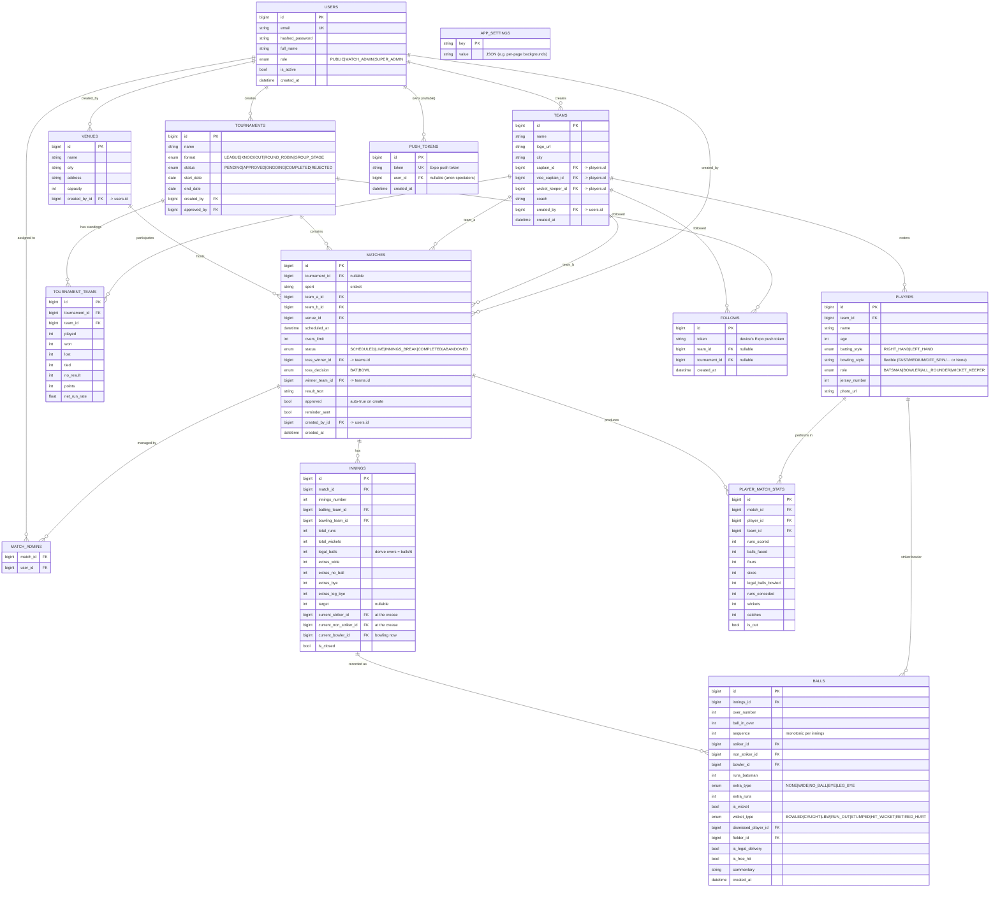

# Entity-Relationship Model — LocalScore

Rendered with Mermaid (GitHub renders this natively). The SQLAlchemy models in
`backend/app/models/` are the source of truth; this diagram mirrors them.



## Notes on the model

- **`legal_balls` over `overs` float.** Overs are stored as an integer count of legal
  deliveries; the `overs` display string (`12.3`) is computed (`balls // 6` dot `balls % 6`).
  This avoids floating-point drift and makes run-rate math exact.
- **Extras are split by type** on the innings so the scorecard can show the
  `(b 4, lb 2, w 5, nb 1)` breakdown without re-scanning every ball.
- **`PLAYER_MATCH_STATS` is a denormalized aggregate** updated transactionally by the
  scoring engine on every ball. It powers fast scorecard and leaderboard reads without
  aggregating the `balls` table on each request. The `balls` table remains the immutable
  source of truth for replay, undo, and wagon-wheel/commentary tabs.
- **`captain_id` → players** is nullable and set after the roster exists (chicken-and-egg
  on team creation is resolved by a follow-up update).
- **Soft multi-sport:** `matches.sport` defaults to `cricket`; cricket tables
  (innings/balls) only populate for cricket matches.
- **Notifications & follows:** `PUSH_TOKENS` holds each device's Expo token;
  `FOLLOWS` ties a device token to a team/tournament so match-live/result pushes
  target followers. `APP_SETTINGS` is a small key/value store (e.g. per-page
  background images). `created_by`/`created_by_id` on teams/venues/matches record
  the authoring admin.
```
